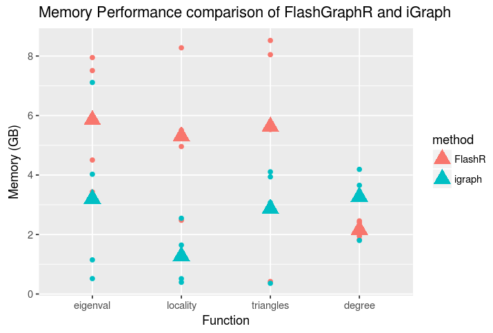
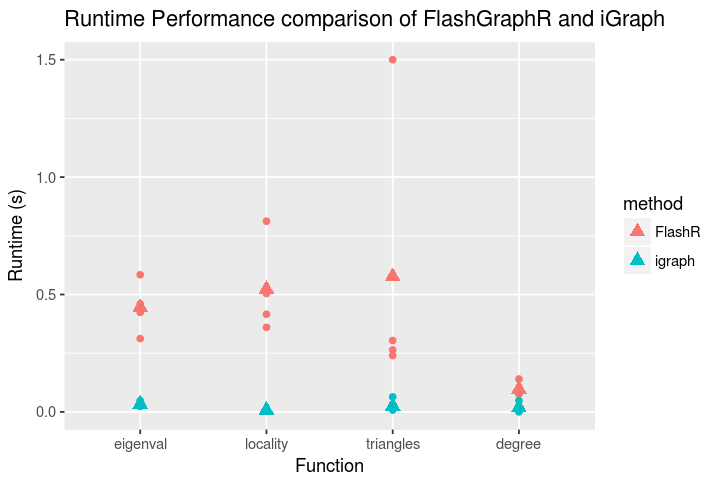

# MRILAB

The FlashX project enables connectomics at an unprecedented scale. Utilizing a combination of cutting edge data analytics algorithms and a semi-external memory framework, FlashX is able to vastly outperform similar state-of-the-art packages on large datasets in a single machine. 

## FlashX enables comparable performance to iGraph on Small MR connectome graphs

In the [flashx/ndmg demo notebook](http://awesomer.cs.jhu.edu:8000/notebooks/flashx-igraph_ndmg_demo_notebook.ipynb), we demonstrate that FlashX and iGraph produce the same results on small graphs (<10,000 vertices) with comparable performance requirements. The graphs here are derived from human diffusion-MRI scans, which are then downsampled spatially to reduce the number of vertices in the resulting structural connectomes. For each node in each graph, we compute the degree, number of adjacent triangles, and the locality statistic for k=1. We also compute the top-100 eigenvalues from the corresponding adjacency matrices for each graph. Shown below are the runtimes for iGraph and FlashX to compute the given statistics:

### Figure 1

### Figure 2

In Figures (1) and (2) above, we can see that iGraph slightly outperforms FlashX on the small graphs, due to a slight overhead for FlashX-enabled analytics. However, both packages show low memory requirements, and neither package shows excessive runtime, indicating that either package is suitable for small graph applications. For each statistic, we compute a density estimate of the values the statistics take. Using the hellinger distance H, a measure of the distance between two density functions, we see that both FlashX and iGraph produce identical results (H=0 for all statistics for all graphs). 
